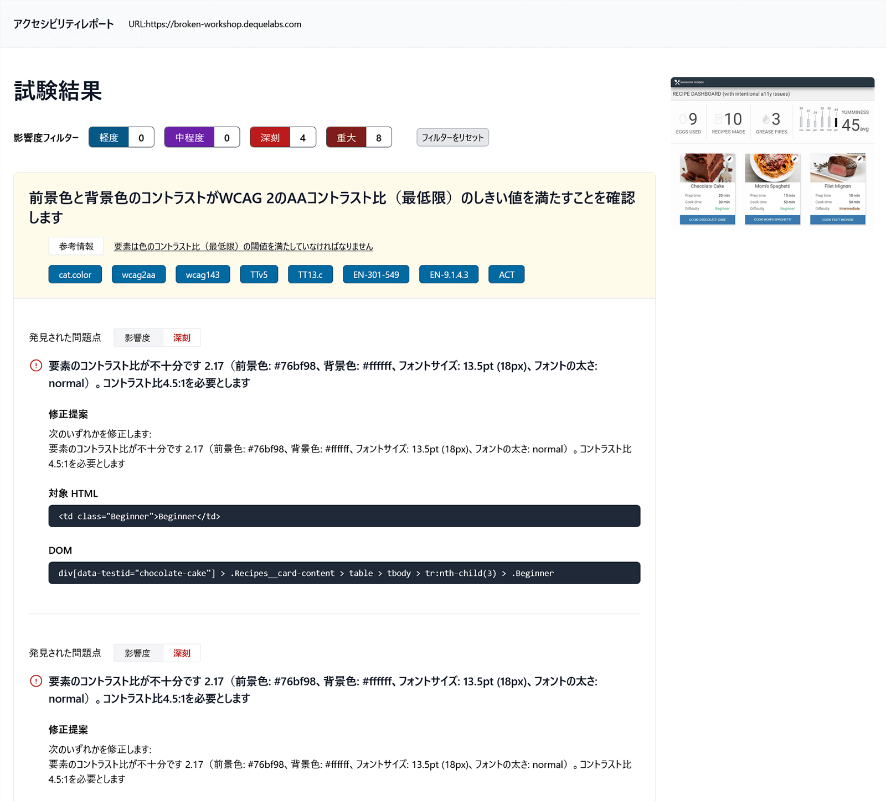

# axe-auto-reporter

Automated accessibility testing script using @axe-core/puppeteer, outputting results as HTML. 

[@axe-core/puppeteer](https://github.com/dequelabs/axe-core-npm/blob/develop/packages/puppeteer/README.md) を使用して、テキストファイルで作成した URL リストに対して自動的にアクセシビリティテストを実行し、その結果を HTML ファイルとして保存するスクリプトです。

## Requirements

Node.js version 22.x or newer.

Node.js 22.x 以上をご利用ください。

## Getting Started

Install Node.js if you haven't already.

```sh
git clone https://github.com/burnworks/axe-auto-reporter.git
cd axe-auto-reporter
npm install
```

### Create `urls.txt`

Rename `urls.sample.txt` to `urls.txt` and edit it to create a list of URLs you wish to test. Separate each URL with a newline.

`urls.sample.txt` を `urls.txt` にリネームした上で編集し、テストを実行したいURLのリストを作ってください。URL は改行で区切ります。

### Run Tests

```sh
node axe-auto-reporter.mjs
```
or

```sh
npm run check
```

When you run the test, a `results` directory will be created, and the test results will be stored inside. Tests are organized by the date and time they were executed, with HTML files saved in the `html` directory and JSON files in the `json` directory.

テストを実行すると `results` ディレクトリが作成され、その中にテスト結果が保存されます。  
テストは実行した日時ごとにディレクトリ分けされ、さらに HTML ファイルは `html` ディレクトリに、JSON ファイルは `json` ディレクトリに保存されます。  
JSON ファイルにはテスト結果のすべてが入っていますので、これを使用して他のデータを作ったりすることもできます。

#### CSV report mode

To export CSV reports instead of HTML, you can execute:

HTML レポートの代わりに CSV 形式のレポートを 1 ファイルで取得したい場合は、次のように実行します。

```sh
node axe-auto-reporter.mjs --mode csv
```
or

```sh
npm run checkcsv
```

This creates the usual JSON files and additionally writes `report.csv` in each run directory. HTML reports and screenshots are skipped in this mode.

通常どおり JSON ファイルが作成され、加えて結果ディレクトリ直下に `report.csv` が保存されます。このモードでは HTML レポートとスクリーンショットの出力はスキップされます。

## Configuration

The configuration file is config.mjs. You can set the following items:

| Property | Default | Description |
| -------- | ------- | ----------- |
| `urlList` | `urls.txt` | list of URLs. |
| `locale` | `ja` | `ja`（日本語） or `en` (English) |
| `tags` | `'wcag2a', 'wcag2aa', 'wcag21a', 'wcag21aa', 'best-practice'` | Axe-core Tags setting. For more details, please refer to the [Axe Javascript Accessibility API](https://github.com/dequelabs/axe-core/blob/master/doc/API.md#axe-core-tags)
| `mode` | `pc` | `pc` or `mobile`. If you set the value to `pc`, the defaultViewport for puppeteer will be `width: 1024, height: 768`. If set to `mobile`, it will be `width: 375, height: 812`. |

`config.mjs` に設定が記述されています。必要に応じて変更してください。

## Caution !

Attempting to run automated tests on too many URLs may not work properly and has the potential to impose excessive load on the destination server. If this happens, please reduce the number of URLs in urls.txt.  
The program is configured to allow only 1 connection per domain, with a 3-second interval between requests (both values can be changed in the configuration file).

あまりに多くの URL に対して自動テストを実行しようとするとうまく行かないかもしれませんし、接続先のサーバに過剰な負荷をかけてしまう可能性があります。  
その場合は `urls.txt` に入れる URL の数を減らすなどしてください。

プログラム的には同一ドメインに対する接続数は 1、アクセス間隔は 3 秒になるようにしてあります（設定ファイルで変更可能）

## Report sample

下記はレポートのサンプル画像です。



## Tailwind CSS

Tailwind CSS is used to generate the stylesheet for the HTML template. It does not affect the functionality of the script.

Tailwind CSS は HTML テンプレートのスタイルシートを生成するために使用しています。スクリプトの動作には関係ありません。つまり、本スクリプトを使用するだけであれば Tailwind CSS はインストール不要です。

***

## アクセシビリティチェックをご希望の企業様へ

何らかの理由で Node.js 実行環境が構築できないが本スクリプトを使用したアクセシビリティチェックを自社サイトに対して実行したいとお考えの企業様。

バーンワークス株式会社では低コストで自動アクセシビリティチェックを実施しますので、お気軽にお問い合わせください。

- [自動アクセシビリティチェックサービス - バーンワークス株式会社](https://burnworks.com/service/accessibility-auto-check/)
